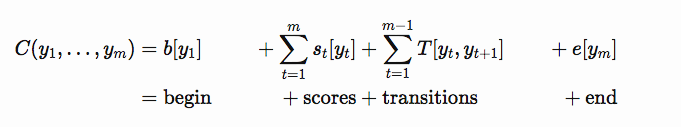
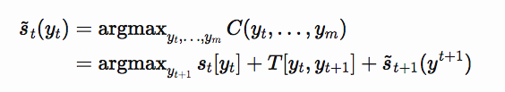

# Machine To Learn
<!--
* 罗列1
	- 罗列二
[回到底部](#resume) 跳转到某个标题，标题都是小写，且用-连接
> 引用的文字
**文字** 字体加粗
`文字` 背景加灰
 引用图片
[百度](https://baidu.com) 跳转到百度
## 二级目录，两行作分隔符
### 三级目录，一行作分隔符
-->


## SQL

### Joins

* Inner join: return records that have matched values in both tables
* Left join: return all records from the left table, if matched in the right table 1 else 0
* Right join: oppsite to left join
* Outer join: return all records when there is a match in either left or right table

### Optimize

[todo]


### FAQ

[todo]


## Statistics and ML

### Project Workflow

Given a data science problem, what steps should we flollow? Or how to design a ML system?
or How to design a recommend engine? Heres are some major steps:

* Specify business objective
* Define the problem: The most important step. You should know how to model your problem and figure out which type it is, supervised or unsupervised, classification or regression.
* Create a baseline: No need to use ML or DL, even random select or rule based.
* Review ML literatures
* ML design
	- Do exploratory data analysis
	- Patition data
	- Preprocess
	- Engineer features
	- Choose proper alogorithm, ML or DL
	- Train, test and validation
	- Ensemble
* Deploy model
* Monitor model
* Iterate model

### Cross Validation

Cross-validation is a technique to enhance model stability and performace by partitioning the original data into training data to train the model, validation data to evaluate it. Usually, a k-fold cross validation divides the data into k folds, trains on each k-1 folds and the left 1 fold to evalatue. This results k models, which can be averaged to get an overall model performance.

### Feature Importance

* In linear models, feature importance can be calculated by the scale of the coefficients!!!
* In tree-based mothods, important features are likely to appear closer to the root of the tree. It can be computed by the average of the depth across all trees.

### Mean Squared Error vs. Mean Absolute Error

namely MSE vs. MAE.

* Similarity:


## Natural Language Processing

### NER

从文本中识别出命名性指称项，为关系抽取、知识图谱等任务做铺垫。

**基于规则的方法**：

利用手工编写的规则对文本进行匹配。需要谨慎处理规则之间的冲突，以及维护成本过大。

**基于特征模版的方法**：

将NER看作是序列标注任务，利用大规模预料来学习出标注模型，从而对句子的各个位置进行标注。常用的模型包括生成式模型HMM、判别式模型CRF等。比较流行的方法是**特征模版 + CRF**的方案。

**基于深度学习+crf的方法**：

```
John  lives in New   York  and works for the European Union
B-PER O     O  B-LOC I-LOC O   O     O   O   B-ORG    I-ORG
```

其中，LOC, PER, ORG and MISC分别代表locations, persons, orgnizations and miscellaneous。B-...代表着一个实体的Beginning，I-...代表一个实体的inside。

**模型是如何得知每个单词的意思？** 需要有一个.txt类似文件保存如下的信息，然后将语料转化为对应的tag序列。

```
EU B-ORG
rejects O
German B-MISC
call O
to O
boycott O
British B-MISC
lamb O
. O

Peter B-PER
Blackburn I-PER
```

现在NLP的大量任务都采用RNN结构，获取上下文的token之间的联系。一般来说，需要考虑如下几个步骤。
* **Word Representation**: 使用一个多维的dense vector来表达单词的含义，而不是one-hot，也不是ngram。可以使用Word2Vec或者FastText来训练词向量模型。这里词向量由两部分组成，词向量工具训练出来的vector跟包含character级别的vector。后者可以是hand-crafted features，例如有0、1组成的component，代表单词是否有大写字母开头，也可以是神经网络训练出来的vector，例如Bi-LSTM。vector=concatenate(word-level, char-level)。
* **Contextual Word Reresentation**: 为了获取一个句子或者文本更强的信息表达，需要使用LSTM或者GRU等结构。
* **Docoding**: 经过LSTM之后，每个step的输出作为token的表达。每个step的output再接一个fully connected layer, 维度为所有NER的种类。为了输出每一个NER类别的概率，有两种方式。
	- Softmax
	- Linear-chain CRF: 使用Softmax虽然考虑了远处token的联系，但是这种关系并不是很强，make local choices，而CRF在预测tag的时候，考虑了上下文的信息，更加准确。给定`w1, ..., wn`的token序列，`s1, ..., sn`的score vector，以及预测目标tag序列`y1, ..., yn`，CRF对每个序列计算一个分数`C`。
	其中`T`是状态转移矩阵，这里的状态是PER, ORG等，假设共有9种，T是一个9x9的矩阵。`e, b`是9维的代价vector，表示某个状态作为一个tag序列开头或结束的惩罚，即每种状态在开始或者结束时的概率不一样，一般是0或者1。



**如何寻找最佳的序列？** 如果暴力搜索的话，时间复杂度是`9^n`，n为序列长度。本质上这个是一个马尔科夫链，下一个状态仅与上一个状态有关。因为可以使用动态规划来解决此问题。下面是从后面往前预测，已知`yt+1, .., yn`的最佳概率，预测`yt`的概率。时间复杂度为`9x9*n`。



**如何寻找概率最大的序列？** Linear chain CRF的最后一步是对所有可能的sequence施加一个softmax，归一化。

[参考](https://guillaumegenthial.github.io/sequence-tagging-with-tensorflow.html)


## System Design

Main steps:

1. Understand the problem and scope

* Define the main scenarios, with the help of the interviewer.
* Sort them and remove items that seems not important here.
* Make sure of high performance, simplicity, scalability and robustness.

2. Think about constraints

* Make clear about some key indicators, like daily active users, average online time, requests per second. Some may be offered, some should be calculated. 
	- **Users**: average_concurrent_users = daily_active_users / daily_seconds * average_online_time. peak_users = average_concurrent_users * 6.
	- **Traffic**: given traffic of each item as `t`, such as user, movie or tweet, then max_peak_traffic = `t` * peak_users.
	- **Memory**: given memory of each item as `m`, such as user, then max_memory = `m` * daily_active_users.
	- **Storage**: given storage of each item as `s`, such as movie or tweet, then total_storage = `s` * average_movie_size. 
* Estimate reads vs. writes percentage, how much data written or read per second?
* Total storage required over 5 years.

3. Abstract design

* Layers (service, function, data, caching).
* Rough overview of any key algorithm that drives the service.
* Consider bottlenecks and determine solutions.

In the following projects, I will show how to solve them to using the flow.


### Design a Cache System

Cache system is a widely adopted technique in almost every applications today. For instance, at network area cache is used in DNS lookup and in web server cache is used for frequent requests.

**LRU**:

One of the most common cache systems is LRU. If A exists in the cache, just return the value. If A does not exist and it has extra storage slots, return none and insert A in the cache. If the cache is full, pop out the least recently used item and push A into it.

Main operations: lookup, insert and delete. A double-linked list is adopted to save the elements, and a hash table comes with a resource identifier as key and the address of the linked list node as value.

**Eviction policy**:

When the cache is full, we need to remove the existing items from the cache. LRU is just one method to pop out the least recently used item. But there are other choices.

* Random Replacement: randomly delete an entry.
* Least frequently used: remove items which are not least used. The frequency of each item must be recorded.
* W-TinyLFU: the problem of LFU is that some items may only be used frequently in the past and will still remain in the cache. It would be a waste of storage resources. It solves this problem by calculating frequency with a time window.

**Concurrency**:

It falls into a reader-writer problem. When multiple clients are updating at the same time, there can be race condition. We can use **lock** the limit the writing order. But it affects the performance a lot.

It is not necessary to update values immediately. We can store all the updates into logs and use another process in the backend to execute the logs asynchronously.

**Distributed cache**:

The object is going to scale the key-value storage into multiple machines. The question is how to split the data into multiple folds. **Sharding** is a horizontal partition of data according to some rule. Each shard is held on a separate instance. For instance, if all keys are string, they can be divided by the first char. This has a problem that storage on each machine may not be balanced. Using hashing of key is also one solution and do mod calculation.


